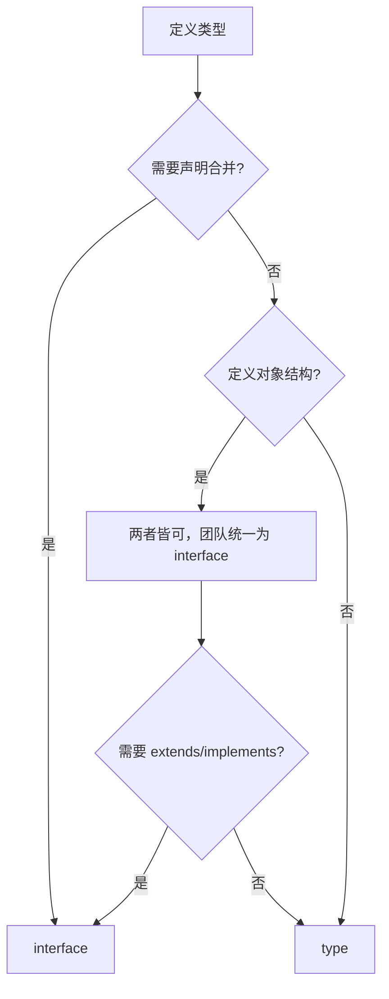

# TypeScript 类型安全指南 v1.2

---

## 快速参考卡片

| 你的需求                          | ❌ 常见错误                     | ✅ 推荐做法                                      |
| --------------------------------- | ------------------------------- | ------------------------------------------------ |
| 外部输入数据（API/配置/用户输入） | `JSON.parse(str) as MyType`     | 先用 Zod 或相似库校验，再使用                    |
| 不知道具体类型                    | `: any`                         | `: unknown` + 类型守卫或 Zod 收窄                |
| 定义对象结构（Props、State）      | 一律用 `type`                   | 默认使用 `interface`，除非需要联合/元组/映射类型 |
| 定义常量对象                      | `const config = { port: 3000 }` | `as const satisfies Config`                      |
| 断言值非空                        | `user!.name`                    | 使用 `asserts` 守卫函数                          |
| 临时绕过类型错误                  | `@ts-ignore`                    | 使用 `@ts-expect-error` + 注释说明原因           |

---

## 前言

TypeScript 的价值在于**编译时捕获类型错误**，而非仅仅提供代码提示。然而在实际项目中，`any` 的滥用、`!` 的随手使用、`@ts-ignore` 的频繁出现，往往让类型系统形同虚设——编译器抓不到 bug，开发者习惯了"绕过"而非"解决"。

本指南旨在解决这一问题。核心原则很简单：

> **让编译器替你抓错误，而不是绕过它。**

### 指导原则

1. **严格优先**：所有项目必须启用 `strict` 模式
2. **零容忍 `any`** ：除极少数边界场景外，禁止使用 `any`
3. **收窄优先于断言**：用类型守卫和运行时校验代替类型断言
4. **明确优于隐式**：公共 API 显式标注类型，内部逻辑依赖推断
5. **工具辅助**：ESLint 规则自动化检查，不让人工审查独力承担

---

## 落地策略：按优先级推进

在深入细节之前，先明确各实践的优先级，帮助团队分阶段落地：

| 优先级 | 实践                                      | 投入 | 预期效果                    | 落地方式                           |
| ------ | ----------------------------------------- | ---- | --------------------------- | ---------------------------------- |
| 🔴 P0  | `strict: true` + `no-explicit-any` ESLint | 中   | 减少 60% 的隐式类型错误     | 修改 tsconfig + ESLint 配置        |
| 🔴 P0  | `unknown` + Zod 校验系统边界              | 高   | 消除 80% 的外部数据相关崩溃 | 渐进式：先覆盖关键 API，再逐步扩展 |
| 🟡 P1  | `import type` + `verbatimModuleSyntax`    | 低   | 优化构建体积，防止循环依赖  | ESLint 自动修复 + 配置开关         |
| 🟡 P1  | `@ts-expect-error` 替换 `@ts-ignore`      | 低   | 防止遗留过时的忽略          | ESLint 自动修复                    |
| 🟢 P2  | `satisfies` + `as const` 惯用法           | 低   | 提升类型推断准确性          | 代码审查 + 知识分享                |
| 🟢 P2  | 可辨识联合重构状态类型                    | 中   | 减少 30% 的无效状态 Bug     | 逐步重构，新模块强制采用           |
| 🟡 P1  | 泛型约束规范化                            | 中   | 消除泛型中的隐式 any        | 新代码审查把关                     |
| 🟢 P2  | 回调 `any` 陷阱专项治理                   | 低   | 消除数组操作中的类型漏洞    | 定期扫库修复                       |

---

## 一、tsconfig 严格配置

类型安全的根基在 `tsconfig.json`。以下配置为**强制基线**。

### 1.1 核心配置（必须启用）

```json
{
  "compilerOptions": {
    "strict": true,
    "noImplicitAny": true,
    "strictNullChecks": true,
    "strictFunctionTypes": true,
    "strictBindCallApply": true,
    "strictPropertyInitialization": true,
    "noImplicitThis": true,
    "alwaysStrict": true
  }
}
```

`"strict": true` 会一次性启用上述所有严格检查选项。**新项目必须启用，存量项目应逐步迁移**。

### 1.2 推荐启用（强烈建议）

| 选项                                 | 作用                                    | 说明                                                                                              |
| ------------------------------------ | --------------------------------------- | ------------------------------------------------------------------------------------------------- |
| `noUncheckedIndexedAccess`           | 索引访问结果的类型变为 `T \| undefined` | 强制你处理数组越界或对象键不存在的情况。`arr[0]` 的类型是 `number \| undefined`                   |
| `exactOptionalPropertyTypes`         | 区分 `undefined` 与属性缺失             | 避免将 `undefined` 隐式赋给可选属性                                                               |
| `verbatimModuleSyntax`               | 强制显式区分类型导入与值导入            | 配合 `import type` 使用，确保类型导入在编译时被正确移除                                           |
| `noPropertyAccessFromIndexSignature` | 禁止通过 `.` 访问索引签名属性           | 迫使使用 `obj["key"]` 访问，避免拼写错误                                                          |
| `noUnusedLocals`                     | 报告未使用的局部变量                    | 防止残存的测试代码、调试变量进入生产                                                              |
| `noUnusedParameters`                 | 报告未使用的函数参数                    | 回调中未使用的参数往往是类型定义不精确的信号                                                      |
| `skipLibCheck`                       | 建议设为 `false`                        | 设为 `true` 会跳过依赖包的类型检查，可能掩盖上游的类型错误。仅在构建速度成为瓶颈时谨慎设为 `true` |

### 1.3 存量项目迁移策略

对于已有项目，不建议一次性全量开启：

1. **第一步**：启用 `noImplicitAny` 和 `strictNullChecks`——这是错误率最高、收益最大的两项
2. **第二步**：逐步将 `any` 替换为 `unknown` + 类型守卫
3. **第三步**：启用 `noUncheckedIndexedAccess` 等进阶选项

---

## 二、禁止 `any`

### 2.1 为什么禁止 `any`

`any` 会**完全禁用类型检查**，让 TypeScript 退化为 JavaScript。任何使用 `any` 的地方，编译器都无法帮你发现错误。

```typescript
// ❌ 禁止：任何使用 any 的地方，类型检查失效
function process(data: any): string {
  return data.user.name.toUpperCase();
  // 编译时：无错误 ✅（但这是假象）
  // 运行时：data 为 null 时崩溃 💥
}

// ❌ 禁止：隐式 any
function getValue(obj, key) {
  // 编译时：❌ error TS7006: Parameter 'obj' implicitly has an 'any' type
  return obj[key];
}
```

### 2.2 隐蔽的 `any` 变种

以下类型看似"安全"，实际上同样削弱了类型检查，应避免使用：

```typescript
// ⚠️ 空对象类型 {} —— 可以接受任何非 null/undefined 的值
let obj: {} = { name: "test" };
obj = 123; // 编译通过 ✅
obj = "string"; // 编译通过 ✅
obj = null; // ❌ 编译错误（null 不可赋值给 {}）
obj = undefined; // ❌ 编译错误

// ⚠️ Object（大写）—— 同样可以接受任何值
let obj2: Object = { name: "test" };
obj2 = 123; // 编译通过 ✅

// ✅ 推荐：使用 Record<string, unknown> 或 unknown
let obj3: Record<string, unknown> = { name: "test" };
obj3 = 123; // ❌ 编译错误：number 不能赋值给 Record<string, unknown>
```

**原则**：`{}` 和 `Object` 在实践中几乎等同于 `any`，应使用 `Record<string, unknown>` 或 `unknown` 代替。

### 2.3 替代方案速查表

| 场景                  | 不要用                | 应该用                                     |
| --------------------- | --------------------- | ------------------------------------------ |
| 接收外部/未类型化数据 | `data: any`           | `data: unknown` + 类型守卫或 Zod           |
| 任意键值对对象        | `Record<string, any>` | `Record<string, unknown>`                  |
| 函数返回类型不确定    | `: any`               | 泛型 `<T>` 或 `: unknown`                  |
| 测试 mock             | `: any`               | `as unknown as MockedType`                 |
| 跨不兼容类型转换      | `as any as Target`    | `as unknown as Target`                     |
| 全局/临时属性扩展     | `window.__DEV__: any` | `unknown` + 类型守卫                       |
| 空对象约束            | `: {}` 或 `: Object`  | `: Record<string, unknown>` 或 `: unknown` |

### 2.4 唯一可豁免的场景

仅有以下四种场景允许使用 `any`，且**必须**附加 ESLint 禁用注释并说明原因：

```typescript
// 1. 第三方 SDK 泛型边界
// eslint-disable-next-line @typescript-eslint/no-explicit-any
// 原因：SDK 的泛型参数无法通过包装器保留

// 2. 测试 mock（Vitest 的 vi.hoisted() 场景）
// eslint-disable-next-line @typescript-eslint/no-explicit-any
// 原因：mock 工厂的返回类型无法完全匹配

// 3. 可变参数转发（参数类型取决于调用方）
// eslint-disable-next-line @typescript-eslint/no-explicit-any
// 原因：转发 ...args 时类型由调用方决定

// 4. 类型补丁——为缺失类型的全局对象扩展定义
// eslint-disable-next-line @typescript-eslint/no-explicit-any
// 原因：临时 bridge，待官方类型发布后移除
interface Window {
  __DEVTOOLS__?: unknown; // 使用 unknown 而非 any
}
```

**其他任何使用 `any` 的场景都是代码异味，必须在合并前重构**。

### 2.5 例外管理流程

- **临时豁免**：附注释说明原因，由技术负责人审批
- **永久豁免**：必须在 ADR（架构决策记录）中记录，并由团队评审
- **定期审计**：每季度检查所有 `eslint-disable` 注释，确认是否仍需要。建议在注释中加入 `// VALID_UNTIL: YYYY-MM-DD`，通过 CI 检查超时。

---

## 三、使用 `unknown` 代替 `any`

当确实不知道类型时，使用 `unknown`——它要求**在使用前必须进行类型收窄**。

### 3.1 基本用法

```typescript
// ✅ 正确：使用 unknown，强制类型检查
function process(data: unknown): string {
  // 必须先收窄类型才能操作
  if (typeof data === "string") {
    return data.toUpperCase();
  }
  throw new Error("Expected string");
}

// ❌ 错误：使用 any 绕过检查
function process(data: any): string {
  return data.toUpperCase();
  // 编译时：无错误 ❌
  // 运行时：data 为 null 时崩溃 💥
}

// ✅ 对象类型守卫示例
function isUser(value: unknown): value is { id: number; name: string } {
  return (
    typeof value === "object" &&
    value !== null &&
    typeof (value as any).id === "number" &&
    typeof (value as any).name === "string"
  );
}
```

### 3.2 处理外部数据（API 响应、JSON 解析）

所有外部输入（API 响应、配置文件、用户输入）都应先解析为 `unknown`，再通过 Zod 等校验库进行验证。

```typescript
import { z } from "zod";

// ❌ 危险：直接断言
const config = JSON.parse(configString) as AppConfig;

// ✅ 安全：先解析为 unknown，再使用 Zod 校验
const ConfigSchema = z.object({
  port: z.number().positive(),
  databaseUrl: z.string().url(),
});

function parseConfig(configString: string): AppConfig {
  const parsed: unknown = JSON.parse(configString);
  return ConfigSchema.parse(parsed); // 校验失败会抛出详细错误
}
```

### 3.3 catch 中的 `unknown`

TypeScript 4.0+ 支持 `useUnknownInCatchVariables`，让 catch 参数默认为 `unknown`。

```typescript
try {
  // ...
} catch (e: unknown) {
  // ✅ 更稳健的收窄方式
  if (e && typeof e === "object" && "message" in e) {
    console.error(String(e.message));
  } else {
    console.error("Unknown error:", e);
  }
}
```

---

## 四、类型守卫与类型收窄

### 4.1 使用类型守卫（`is`）

对于复杂类型，定义类型守卫函数是安全的做法。

```typescript
interface ApiResponse {
  user: { name: string };
}

function isApiResponse(data: unknown): data is ApiResponse {
  return (
    typeof data === "object" &&
    data !== null &&
    "user" in data &&
    typeof (data as ApiResponse).user?.name === "string"
  );
}

function processResponse(data: unknown): string {
  if (!isApiResponse(data)) {
    throw new Error("Invalid API response");
  }
  return data.user.name.toUpperCase(); // 类型安全
}
```

### 4.2 使用 Zod 等运行时校验库

在系统边界（API 入口、配置加载、用户输入），推荐使用 Zod 进行运行时校验。

```typescript
import { z } from "zod";

const UserSchema = z.object({
  id: z.number(),
  name: z.string(),
  email: z.string().email(),
});

type User = z.infer<typeof UserSchema>;

function validateUser(data: unknown): User {
  return UserSchema.parse(data); // 校验失败会抛出详细错误
}
```

### 4.3 收窄优先级

处理未知类型时，按以下优先级选择收窄方式：

1. **Zod / 类似校验库** —— 系统边界首选
2. **自定义类型守卫** —— 可复用的类型检查
3. **`typeof` / `instanceof` / `in` 操作符** —— 简单场景
4. **类型断言 `as`** —— 仅在已通过其他方式确认类型安全时

> 在系统边界**必须**使用 Zod 或类似库；在内部逻辑中可以使用 `typeof`/`in` 等轻量收窄，但永远不要对外部输入仅用 `as` 断言。

### 4.4 泛型与索引访问安全

泛型不加约束会退化为 `any` 级别的不安全。结合 `keyof` 可以安全地访问对象属性。

```typescript
// ❌ 危险：泛型无约束，且 key 为 string，退化为 any
function getProperty<T>(obj: T, key: string) {
  return obj[key]; // 编译时：❌ error TS7053: Element implicitly has an 'any' type
}

// ✅ 安全：泛型有约束，且 key 受限于对象的键
function getProperty<T extends Record<string, unknown>>(
  obj: T,
  key: keyof T,
): T[keyof T] {
  return obj[key]; // 这里 key 必定是 T 的键，不会有 undefined 风险
}

// ✅ 更精细的约束：只允许特定形状
function handleUser<T extends { id: number; name: string }>(user: T): string {
  return user.name.toUpperCase();
}
```

**原则**：泛型参数应始终有明确的约束边界，除非是 `Array<T>` 这样由容器本身决定类型的场景。

### 4.5 回调中的 `any` 陷阱

数组方法的回调参数容易被隐式推断为 `any`，这是一个常见漏洞。**首要防线**是保证 `getData` 等源头函数的返回类型是安全的。

```typescript
// ❌ 危险：如果 getData 返回 any[]，回调参数自动推断为 any
const items: any[] = getData(); // 问题根源在于 getData 的返回类型
items.forEach((item) => {
  console.log(item.name); // 编译时：无错误 ✅，但运行可能崩溃 💥
});

// ✅ 安全：先确保源头函数类型安全，或使用 Zod 校验整个数组
const ItemsSchema = z.array(ItemSchema);
const safeItems = ItemsSchema.parse(getData());
safeItems.forEach((item) => {
  console.log(item.name); // item 类型安全
});
```

---

## 五、`type` vs `interface` 与类型兼容性

### 5.1 选择决策流



### 5.2 选择指南

| 场景                            | 推荐        | 原因                            |
| ------------------------------- | ----------- | ------------------------------- |
| 定义对象结构（公共 API、Props） | `interface` | 可扩展、支持声明合并            |
| 需要声明合并（扩展第三方类型）  | `interface` | `interface` 的独有能力          |
| 联合类型                        | `type`      | `interface` 不支持              |
| 元组类型                        | `type`      | `interface` 不支持              |
| 映射类型 / 条件类型             | `type`      | `interface` 不支持              |
| 函数类型                        | `type`      | 更简洁，但 `interface` 支持重载 |
| 工具类型（Utility Types）       | `type`      | 更灵活                          |

### 5.3 对比示例

```typescript
// ✅ 推荐：type 定义函数类型
type FetchFn = (url: string) => Promise<Response>;

// 可选：interface 定义函数类型，并支持重载
interface FetchFn {
  (url: string): Promise<Response>;
  (url: string, options: RequestInit): Promise<Response>;
}
```

### 5.4 类型兼容性（结构类型系统）

TypeScript 的类型兼容性基于**成员子集**，即 `A` 可以赋值给 `B`，当且仅当 `A` 拥有 `B` 的所有必要成员。

```typescript
type User = { name: string };
type Person = { name: string; age?: number };

// ✅ 正确：User 是 Person 的子集
const user: User = { name: "Alice" };
const person: Person = user; // 可以赋值

// ❌ 错误（严格函数类型检查下）：Person 不是 User 的子集
const getPerson = (p: Person) => p.name;
const fn: (u: User) => string = getPerson;
// 编译时：❌ error TS2322: Type '(p: Person) => string' is not assignable to type '(u: User) => string'
```

这与 `strictFunctionTypes` 的作用密切相关，它确保了函数参数类型的检查是**逆变**的，防止不安全的赋值。

### 5.5 团队约定

> **默认使用 `interface` 定义对象结构，当 `interface` 无法满足时（联合类型、元组、映射类型等）再使用 `type`。**

（注：社区也存在"优先 `type`"的观点。本团队选择 `interface` 优先，是基于其声明合并能力在扩展第三方类型和公共 API 演进中更具优势。）

---

## 六、`import type` 规范

### 6.1 为什么使用 `import type`

- **编译时零开销**：`import type` 在编译后会被完全移除，不产生运行时依赖
- **更好的 Tree Shaking**：明确区分类型与值，打包工具可更高效地剔除无用代码
- **防止循环依赖**：类型导入不会产生运行时的模块依赖关系
- **语义清晰**：一眼就能看出导入的是类型还是值

### 6.2 使用规则

**规则：仅导入类型时，必须使用 `import type`**

```typescript
// ✅ 正确：纯类型导入
import type { User, Post } from "./types";

// ✅ 正确：混合导入（同一模块既有类型又有值）
import { type User, fetchUser, createUser } from "./user";

// ❌ 错误：类型未标记，编译器可能保留不必要的导入
import { User } from "./types"; // User 是类型，但未用 type 标记
```

### 6.3 语法选择

| 语法                                     | 适用场景                              |
| ---------------------------------------- | ------------------------------------- |
| `import type { Foo } from 'module'`      | 整行仅导入类型，语义最清晰            |
| `import { type Foo, Bar } from 'module'` | 同一模块同时需要类型 `Foo` 和值 `Bar` |

配合 `tsconfig` 中的 `"verbatimModuleSyntax": true`，编译器会强制要求显式区分类型导入与值导入。

---

## 七、禁止滥用非空断言 `!`

### 7.1 为什么谨慎使用 `!`

非空断言 `!` 告诉 TypeScript"这个值一定不是 `null` 或 `undefined`"，但它**绕过了编译器的空值检查**。如果断言错误，问题会在**运行时**暴露，而非编译时。

```typescript
// ❌ 危险：非空断言掩盖了潜在的空值问题
const name = user!.name;
// 编译时：无错误 ✅
// 运行时：user 为 null 时崩溃 💥

// ❌ 危险：断言一个可能不存在的 DOM 元素
const element = document.getElementById("app")!;
// 编译时：无错误 ✅
// 运行时：元素不存在时，element 为 null，后续操作崩溃 💥
```

### 7.2 正确做法

使用 `asserts` 守卫函数是更安全、更专业的替代方案：

```typescript
// ✅ 方案1：使用 asserts 守卫
function assertExists<T>(
  value: T | null | undefined,
  msg: string,
): asserts value is T {
  if (value == null) throw new Error(msg);
}

const root = document.getElementById("root");
assertExists(root, "Root element missing");
root.innerHTML = "..."; // TypeScript 知道 root 非空

// ✅ 方案2：运行时检查
if (!user) {
  throw new Error("User is required");
}
const name = user.name;

// ✅ 方案3：可选链 + 空值合并
const name = user?.name ?? "Unknown";
```

### 7.3 可接受的场景

如果确实需要使用 `!`，应优先使用 `asserts` 守卫；只有在极少数确信安全的情况下才用 `!`，且必须附加注释说明原因：

```typescript
// 🟡 可接受（有注释说明安全原因）
const root = document.getElementById("root")!; // 该元素在 HTML 中由模板保证存在
```

**ESLint 规则**：建议启用 `@typescript-eslint/no-non-null-assertion` 来强制审查每一个 `!` 的使用。

---

## 八、禁止 `@ts-ignore`，使用 `@ts-expect-error`

### 8.1 核心区别

`@ts-expect-error` 和 `@ts-ignore` 的设计意图有本质不同：

|                    | `@ts-expect-error`            | `@ts-ignore`              |
| ------------------ | ----------------------------- | ------------------------- |
| **语义**           | **预期**下一行有错误          | **无条件**忽略下一行      |
| **当错误存在时**   | 屏蔽错误 ✅                   | 屏蔽错误 ✅               |
| **当错误不存在时** | ❌ 报错"注释未使用"，强制移除 | ✅ 静默残留，成为技术债务 |
| **使用场景**       | 临时对抗上游类型定义 bug      | 几乎总是错误选择          |

```typescript
// ❌ 禁止：无条件屏蔽，错误修复后仍残留
// @ts-ignore
const result: string = someUntypedLibrary.doSomething();

// ✅ 推荐：有条件屏蔽，错误修复后会报错提醒移除
// @ts-expect-error - FIXME(@张三): 上游 @types/foo 的返回类型声明为 string，实际返回 number，等待 v2.0.0 修复 (#456)
const result: string = someUntypedLibrary.doSomething();
```

### 8.2 使用规范

| 指令               | 状态        | 要求                                       |
| ------------------ | ----------- | ------------------------------------------ |
| `@ts-expect-error` | ✅ **推荐** | 必须附加注释说明原因，推荐关联 Issue       |
| `@ts-ignore`       | ❌ **禁止** | 除非极特殊情况，经技术负责人批准           |
| `@ts-nocheck`      | ❌ **禁止** | 应在 tsconfig 中统一管理，而非在文件中屏蔽 |

**ESLint 规则**：启用 `@typescript-eslint/prefer-ts-expect-error`，自动将 `@ts-ignore` 标记为错误。

---

## 九、类型推断与显式标注的平衡

### 9.1 何时依赖推断

```typescript
// ✅ 局部变量：让 TypeScript 推断
const count = 10; // 推断为 number
const items = ["a", "b"]; // 推断为 string[]
const user = { id: 1, name: "Alice" }; // 推断为 { id: number; name: string }

// ✅ 简单返回值：让 TypeScript 推断
function add(a: number, b: number) {
  return a + b; // 推断为 number
}

// ✅ 常量字面量：使用 as const 保留精确类型
const STATUS = { ACTIVE: "active", INACTIVE: "inactive" } as const;
```

### 9.2 何时必须显式标注

```typescript
// ✅ 公共 API 导出：必须显式标注
export interface UserService {
    getUser(id: number): Promise<User>;
}

// ✅ 函数参数：必须显式标注（noImplicitAny 会强制）
function processUser(user: User): void { ... }

// ✅ 复杂对象返回：显式标注可防止意外变更
function fetchConfig(): AppConfig { ... }

// ✅ 变量初始化为空值：需要显式标注
const config: AppConfig | null = null;
```

### 9.3 过度标注的反模式

```typescript
// ❌ 过度标注：显式写了一个很宽泛的类型，丢失了具体信息
const config: AppConfig = { port: 3000 };
// config.port 类型为 number（而非 3000 字面量）

// ✅ 让 TypeScript 推断，或用 satisfies 保留字面量
const config = { port: 3000 } satisfies AppConfig;
// config.port 类型为 3000
```

---

## 十、类型断言规范

### 10.1 类型断言层级（从安全到危险）

优先选择最安全的选项：

1. **无断言** —— 使用类型守卫、Zod 或泛型让 TypeScript 自动推断
2. **`as Type`** —— 当 TypeScript 无法推断但你已通过其他方式验证
3. **`as unknown as Type`** —— 跨不相关类型边界（如测试 mock）。本质上绕过了类型系统，应优先考虑重构代码结构
4. **`as any`** —— 最后手段，仅限第 2.4 节列出的四种豁免场景

### 10.2 `satisfies` 运算符（TypeScript 4.9+）

`satisfies` 在**校验类型**的同时**保留字面量类型推断**，是比 `as` 更安全的选择。

```typescript
type Route = { path: string; children?: Routes };
type Routes = Record<string, Route>;

// ❌ 使用 as：丢失了字面量类型
const routes = {
  HOME: { path: "/" },
  AUTH: { path: "/auth" },
} as Routes;
// routes.HOME.path 类型为 string（而非 "/"）

// ✅ 使用 satisfies：既校验类型，又保留字面量
const routes = {
  HOME: { path: "/" },
  AUTH: { path: "/auth" },
} satisfies Routes;
// routes.HOME.path 类型为 "/"（字面量保留）
// routes.NONEXISTENT  // ❌ 类型错误
```

**联合类型场景**：

```typescript
type Config = { port: number } | { url: string };

// ✅ satisfies 确保对象符合 Config，同时保留具体属性
const config = { port: 3000 } satisfies Config;
// config.port 类型为 3000（字面量），而非 number
```

### 10.3 `as const` 断言

对于常量定义，使用 `as const` 可以获得最精确的字面量类型。

```typescript
// ❌ 类型宽泛
const STATUS = { ACTIVE: "active", INACTIVE: "inactive" };
// 类型: { ACTIVE: string; INACTIVE: string }

// ✅ 精确字面量类型
const STATUS = { ACTIVE: "active", INACTIVE: "inactive" } as const;
// 类型: { readonly ACTIVE: "active"; readonly INACTIVE: "inactive" }

// ✅ 与 satisfies 结合使用
const config = { port: 3000 } as const satisfies Config;
```

---

## 十一、可辨识联合

用可辨识联合代替可选属性的"大杂烩"对象，让 TypeScript 帮你做穷尽性检查。

```typescript
// ❌ 不好：所有属性都是可选的，状态不清晰
interface Response {
  data?: Data;
  error?: Error;
  loading?: boolean;
}

// ✅ 好：可辨识联合，每个状态类型明确
type Response =
  | { status: "loading" }
  | { status: "success"; data: Data }
  | { status: "error"; error: Error };

function handleResponse(res: Response) {
  switch (res.status) {
    case "loading":
      break;
    case "success":
      console.log(res.data);
      break;
    case "error":
      console.error(res.error);
      break;
    default:
      // ✅ 利用 never 做穷尽性检查
      // 如果遗漏了某个状态，res 在 default 中的类型不是 never，赋值会报错
      const _exhaustive: never = res;
  }
}
```

> **关键点**：`default` 分支中的 `res` 只有在 switch 覆盖了所有联合成员时才会被推断为 `never`。如果漏掉了某个状态，`res` 仍有残留类型，赋值给 `never` 会报错，从而提醒开发者补充缺失的 case。

---

## 十二、ESLint 自动化规则

以下规则应配置为 `error`，让工具自动拦截类型不安全代码：

| ESLint 规则                                  | 作用                                          |
| -------------------------------------------- | --------------------------------------------- |
| `@typescript-eslint/no-explicit-any`         | 禁止使用 `any`                                |
| `@typescript-eslint/no-unsafe-assignment`    | 禁止将 `any` 赋值给其他变量                   |
| `@typescript-eslint/no-unsafe-call`          | 禁止调用 `any` 类型的值                       |
| `@typescript-eslint/no-unsafe-member-access` | 禁止访问 `any` 类型的成员                     |
| `@typescript-eslint/no-unsafe-return`        | 禁止返回 `any`                                |
| `@typescript-eslint/no-non-null-assertion`   | 禁止使用非空断言 `!`                          |
| `@typescript-eslint/prefer-ts-expect-error`  | 强制使用 `@ts-expect-error` 代替 `@ts-ignore` |
| `@typescript-eslint/no-unused-vars`          | 配合类型导入使用，避免未使用的变量            |

### 自动修复命令

```bash
# 自动修复 import type 等可自动修复的问题
npm run lint -- --fix

# 检查 any 覆盖率（需安装 type-coverage）
npx type-coverage --strict --at-least 95
```

---

## 十三、代码审查清单

PR 审查时必须确认：

| #   | 检查项                                                                              | 责任人              |
| --- | ----------------------------------------------------------------------------------- | ------------------- |
| 1   | `tsconfig.json` 是否启用了 `strict: true`？                                         | 开发/架构           |
| 2   | `any` 的使用是否属于豁免场景并有 ESLint 禁用注释和原因说明？                        | 开发/Reviewer       |
| 3   | 是否使用了 `{}` 或 `Object` 作为类型？应改为 `Record<string, unknown>`              | 开发/Reviewer       |
| 4   | 外部数据（API、配置、用户输入）是否使用了 `unknown` + 类型守卫/Zod 校验？           | 开发                |
| 5   | catch 参数是否使用了 `unknown` 而非 `any`？                                         | 开发                |
| 6   | 类型导入是否使用了 `import type`？                                                  | 开发（ESLint 自动） |
| 7   | `type` 与 `interface` 的选择是否符合团队约定？                                      | Reviewer            |
| 8   | 是否存在 `!` 非空断言？如有，是否有注释说明安全原因？                               | Reviewer            |
| 9   | 是否存在 `@ts-ignore`？是否已替换为 `@ts-expect-error` 并附注释？                   | Reviewer            |
| 10  | 类型断言是否使用了最安全的层级？是否可用 `satisfies` 代替？                         | Reviewer            |
| 11  | 复杂状态是否使用了可辨识联合而非可选属性大杂烩？                                    | Reviewer            |
| 12  | 是否存在过度标注（如 `const x: Type = {...}` 丢失字面量类型）？                     | Reviewer            |
| 13  | AI 生成的代码是否已检查所有类型断言和非空断言？（AI 有过度使用 `as` 和 `!` 的倾向） | Reviewer            |
| 14  | 依赖包的类型定义（`@types/*`）是否与源码版本匹配？                                  | 开发                |

---

## 十四、完整示例

```typescript
/**
 * @file 用户认证服务
 *
 * @ai-generated claude-4.6
 * @ai-reviewed 张三 2026-08-12
 */

import type { User, AuthResult } from "./types";
import { z } from "zod";

// =============== 类型定义 ================

/** 登录请求参数（使用 interface 定义公共契约） */
export interface LoginRequest {
  username: string;
  password: string;
}

/** 认证状态（使用可辨识联合） */
export type AuthState =
  | { status: "idle" }
  | { status: "loading" }
  | { status: "authenticated"; user: User }
  | { status: "error"; error: AuthError };

// =============== 运行时校验 ================

/** 登录请求校验 Schema（系统边界使用 Zod） */
const LoginRequestSchema = z.object({
  username: z.string().min(1),
  password: z.string().min(8),
});

/** 校验外部输入 */
function validateLoginRequest(data: unknown): LoginRequest {
  return LoginRequestSchema.parse(data);
}

// =============== 类型守卫 ================

function isAuthError(value: unknown): value is AuthError {
  return (
    typeof value === "object" &&
    value !== null &&
    "code" in value &&
    "message" in value
  );
}

// =============== 核心逻辑 ================

/**
 * 执行用户登录
 *
 * @param input - 登录请求（原始输入，类型未知）
 * @returns 认证结果
 * @throws {ValidationError} 输入格式无效
 */
export async function login(input: unknown): Promise<AuthResult> {
  // # 输入校验（unknown → 类型安全）
  const validated = validateLoginRequest(input);

  // # 执行认证
  try {
    const response = await fetch("/api/auth/login", {
      method: "POST",
      body: JSON.stringify(validated),
    });

    const data: unknown = await response.json();

    // 使用 Zod 校验 API 响应
    const result = AuthResultSchema.parse(data);
    return result;
  } catch (e: unknown) {
    // catch 参数使用 unknown，需要收窄
    if (isAuthError(e)) {
      throw new AuthServiceError(e.message, e.code);
    }
    if (e instanceof Error) {
      throw new AuthServiceError(e.message, "UNKNOWN");
    }
    throw new AuthServiceError("An unknown error occurred", "UNKNOWN");
  }
}
```

---

## 附录 A：进阶话题

### A.1 品牌类型（Branded Types）

利用名义类型模拟，区分语义相同但底层类型不同的值。

```typescript
type UserId = string & { __brand: "UserId" };
type OrderId = string & { __brand: "OrderId" };

function createUserId(id: string): UserId {
  return id as UserId;
}
// 编译时：UserId 和 OrderId 不能混用
```

**⚠️ 运行时注意事项**：品牌类型只在编译时存在，运行时会被完全擦除。这意味着它无法防止运行时传入错误的值，必须配合 Zod 等校验库在边界做校验：

```typescript
import { z } from "zod";

// ✅ 配合 Zod 使用更安全
const UserIdSchema = z.string().brand("UserId");
type UserId = z.infer<typeof UserIdSchema>;

function createUserId(id: string): UserId {
  return UserIdSchema.parse(id); // 运行时校验
}
```

**何时使用**：区分 ID、邮箱、电话号码等语义不同但底层类型相同的值。

### A.2 协变 / 逆变

`strictFunctionTypes` 为何重要？它使函数参数类型检查从**双向协变**改为**逆变**，防止不安全的参数传递。

```typescript
type Animal = { name: string };
type Dog = Animal & { bark: () => void };

// 无 strictFunctionTypes 时，以下赋值不会报错（不安全）
let f: (animal: Animal) => void = (dog: Dog) => dog.bark();
// 实际调用时可能传入非 Dog 类型，运行时崩溃
```

**何时使用**：理解 `strictFunctionTypes` 的作用，保持启用即可。

### A.3 类型级编程的安全原则

使用条件类型、映射类型、模板字面量类型时，注意：

- 优先使用内置工具类型（`Partial`、`Pick`、`Omit`、`ReturnType`）
- 自定义工具类型需充分测试边界情况
- 避免过于复杂的类型计算，必要时用 `// DESIGN:` 注释说明意图

### A.4 Monorepo 下的类型共享

- 共享类型定义放在 `packages/shared-types` 包中
- 使用 `import type` 避免运行时依赖
- 类型包变更需作为 breaking change 管理
- 上下游使用 `@ts-expect-error` 标记临时不兼容

---

## 附录 B：AI 辅助开发类型安全检查要点

AI 生成代码（Copilot、Cursor、Claude 等）有过度使用类型断言 `as` 和非空断言 `!` 的倾向。审查 AI 生成的代码时，应重点检查：

1. **所有 `as` 断言** —— 是否能用 `satisfies` 或类型守卫替代？AI 经常在泛型约束不足时回退到 `as any`
2. **所有 `!` 断言** —— 能否用 `if` 判断或 `asserts` 守卫替代？
3. **所有 `any`** —— AI 经常在不知道类型时直接使用 `any`，应改为 `unknown` + 类型守卫
4. **数组回调参数** —— AI 可能忽略收窄，直接使用 `items.forEach(item => ...)` 而 `item` 被推断为 `any`
5. **泛型约束** —— AI 常写 `function<T>(arg: T)` 而忘记加约束，应补充 `extends ...`

> 建议在 PR 模板中增加一项："**AI 生成的代码是否已通过类型安全检查清单？**"

---

## 附录 C：工具链集成

### C.1 CI 流程

在 CI 中强制执行类型检查：

```json
{
  "scripts": {
    "type-check": "tsc --noEmit",
    "lint": "eslint . --ext .ts,.tsx"
  }
}
```

### C.2 `type-coverage` 工具

使用 `type-coverage` 统计项目中 `any` 的覆盖率，设定目标值（如 95%）。

```bash
npx type-coverage --strict --at-least 95
```

### C.3 ESLint 插件

- `eslint-plugin-etc`：提供 `no-void`、`no-deprecated` 等补充规则
- `eslint-plugin-import`：配合 `import type` 使用，检查导入排序和循环依赖

---

> **类型系统的价值不在于"通过编译"，而在于"捕获错误"。每一次绕过类型检查，都是在放弃编译器替你发现问题的机会。让工具为你工作，而不是与工具对抗。**

_本文档将持续演进，欢迎通过反馈建议。_
